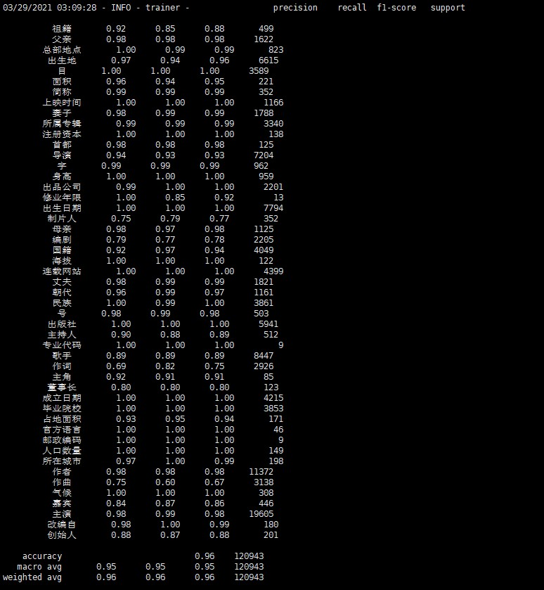

## R-BERT
R-BERT是用分类的思想实现关系抽取。与基于BERT模型的分类模型有一些区别：
加入实体的标志符号，在BERT提取特征后，又提取了两个实体的词向量作为特征；
思想比较简单，模型的效果很好。
## 数据集
   ccks2019关系抽取的数据集。将数据集处理为下面的格式：
 ```
出生日期 \t <e1>汪晋贤</e1>，<e2>1996年1月2日</e2>出生于湖北省武汉市，身高175cm，是一名中场球员，现效力于大连一方足球俱乐部
```
## 代码结构
```
|__main.py
|__data_loader.py
|__model.py
|__trainer.py
|__utils.py
|__export_onnx.py
|__predict.py
```
## 模型结果
